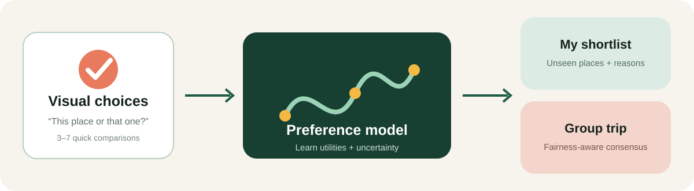

# Roam

**Roam learns what kind of trip feels right to you from a small number of visual choices, then recommends unseen destinations. It can also combine several travelers' learned profiles to find a place the whole group can enjoy.**

This is a self-contained Project 0 prototype for 24-679, *Designing and Prototyping AI Systems*. It includes a visual Streamlit interface, a non-trivial pairwise preference model, active question selection, explanations, portable profiles, and group recommendations.



## Live website

Use the browser-native version at **[ishaanmahajan.com/ROAM](https://ishaanmahajan.com/ROAM/#discover)**. It runs entirely in the browser through GitHub Pages, stores choices in local browser storage, and requires no Python installation or hosted application server.

**Website visitors do not install anything:** the public version is plain HTML, CSS, and JavaScript, and its preference model runs locally in any modern browser. Python and the packages in `requirements.txt` are only for developers who want to run the reference Streamlit app, execute the test suite, or regenerate assets.

The Streamlit version remains the reference Python implementation and local development interface. The static site in `docs/` mirrors its core pairwise learning, recommendation, profile-sharing, and group-ranking behavior in JavaScript so it can run on static hosting.

## What you can do

- Choose instinctively between pairs of illustrated destinations.
- Get a ranked shortlist of places that have not appeared in your choices.
- See which travel qualities most influenced the learned profile and each result.
- Save a profile in the current session or download it as a small JSON file.
- Upload friends' profile files and combine them in Group Trip mode.
- Try group mode immediately with clearly labeled synthetic example profiles.

The public website requires no API key, account, database, model download, Python runtime, or installed package. The 20 destination postcards and all browser code are bundled with the site.

## How the intelligence works

### 1. Destination representation

Each destination is represented by ten normalized visual-semantic qualities: Beach, Nature, Adventure, Culture, Food, Nightlife, History, Relaxation, Budget-friendly, and Cool climate. Values and descriptions are in [`roam/data.py`](roam/data.py), so the prototype's assumptions can be inspected rather than hidden.

This lightweight classroom prototype deliberately uses transparent, hand-curated features rather than running [OpenAI CLIP](https://github.com/openai/CLIP). CLIP is trained on image–text pairs and can encode both images and natural-language descriptions into a shared representation, making it a natural future extension for recognizing visual similarities across a much larger collection of destination photographs without manually rating every place.

A more advanced Roam could precompute CLIP embeddings from licensed destination photos, compare them with prompts such as “a quiet natural retreat” or “a lively historic city,” and feed those compact visual-semantic features into the same pairwise preference model. CLIP is not used in this prototype so the system remains small, deterministic, explainable, zero-install for website visitors, and reproducible without downloading a large model or photo dataset.

### 2. Pairwise preference learning

For a choice where destination *A* wins over *B*, Roam models:

```text
P(A > B) = sigmoid(w · (features(A) - features(B)))
```

The weight vector `w` is fitted with regularized maximum likelihood using Newton updates. L2 regularization acts as a conservative prior, which matters because the user supplies only a few comparisons. The inverse Hessian supplies a local uncertainty estimate. This is a Bradley–Terry-style logistic utility model, implemented from scratch with NumPy in [`roam/model.py`](roam/model.py).

### 3. Active pair selection

Roam does not pick the next pair randomly. It scores candidate pairs using four signals:

- model uncertainty about the difference;
- how close the current predicted utilities are;
- semantic diversity between the destinations; and
- an exposure bonus for less frequently shown places.

That favors choices likely to teach the model something useful while keeping the interaction varied.

### 4. Recommendations and explanations

The learned model scores every destination. Places already shown are excluded so the output is genuinely a discovery list. A match percentage is a calibrated presentation of relative model utility, not an objective probability that a person will enjoy a trip. Explanations expose the strongest positive feature contributions for each recommendation.

### 5. Group mode

Each member's destination utilities are z-normalized before aggregation, preventing a high-magnitude profile from overpowering everyone else. Roam then gives every traveler equal influence:

```text
group_score = mean(normalized_member_scores)
```

The UI also reports the standard deviation between member scores as disagreement, rather than pretending a group recommendation is unanimous.

## Quick Start to Reproduce ROAM on your local machine

Python 3.10 or newer is recommended.

```bash
python3 -m venv .venv
source .venv/bin/activate            # Windows: .venv\Scripts\activate
python -m pip install -r requirements.txt
streamlit run app.py
```

Streamlit prints a local URL (normally `http://localhost:8501`). Open it, make at least three choices in **Discover**, then visit **My Taste**. Seven choices produce a stronger first profile.

After installing the requirements, run the automated model and UI tests with:

```bash
python -m unittest discover -s tests -v
```

To regenerate the local postcard dataset deterministically:

```bash
python scripts/generate_artwork.py
```

## Project structure

```text
ROAM/
├── app.py                        # Single Streamlit entry point and all four views
├── roam/
│   ├── data.py                   # Destination records and semantic embeddings
│   ├── model.py                  # Learning, active queries, ranking, group aggregation
│   └── profiles.py               # Safe JSON import/export and demo profiles
├── assets/destinations/          # 20 bundled offline SVG postcards
├── scripts/generate_artwork.py   # Deterministic postcard generator
├── tests/                        # Model tests plus a full Streamlit journey test
├── docs/roam-flow.svg            # System overview used in this README
├── docs/index.html                # GitHub Pages entry point
├── docs/styles.css                # Responsive static-site presentation
├── docs/app.js                    # Browser-side learning and interaction logic
└── requirements.txt              # Minimal runtime dependencies
```

In Streamlit, user choices live only in session state and disappear when the session ends. On the public website, choices stay in that browser's local storage. Downloaded profile JSON contains feature weights and a comparison count, not the original choice history.

## Design decisions and limitations

- **Small and legible over broad and opaque.** Twenty destinations make this a compelling demo, not comprehensive travel coverage.
- **Illustrations over network photos.** The generated postcard images avoid broken links, copyright ambiguity, tracking, and external services. Their alt text identifies each destination.
- **Taste is not feasibility.** Roam does not account for current cost, visas, disability access, safety, season, carbon impact, or live availability. Those must be checked independently.
- **Feature ratings are subjective.** They are authored prototype data and can carry cultural bias. Production data should be documented, audited, licensed, and evaluated with diverse travelers.
- **Match scores are relative.** They should support exploration, not be interpreted as guarantees.
- **Example people are synthetic.** Maya, Theo, and Sam exist only to demonstrate group mode and are labeled in the interface.

## AI-use disclosure

OpenAI Codex was used to assist with implementation, interface copy, procedural artwork code, tests, and documentation.
